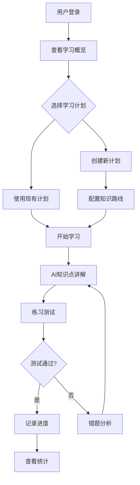
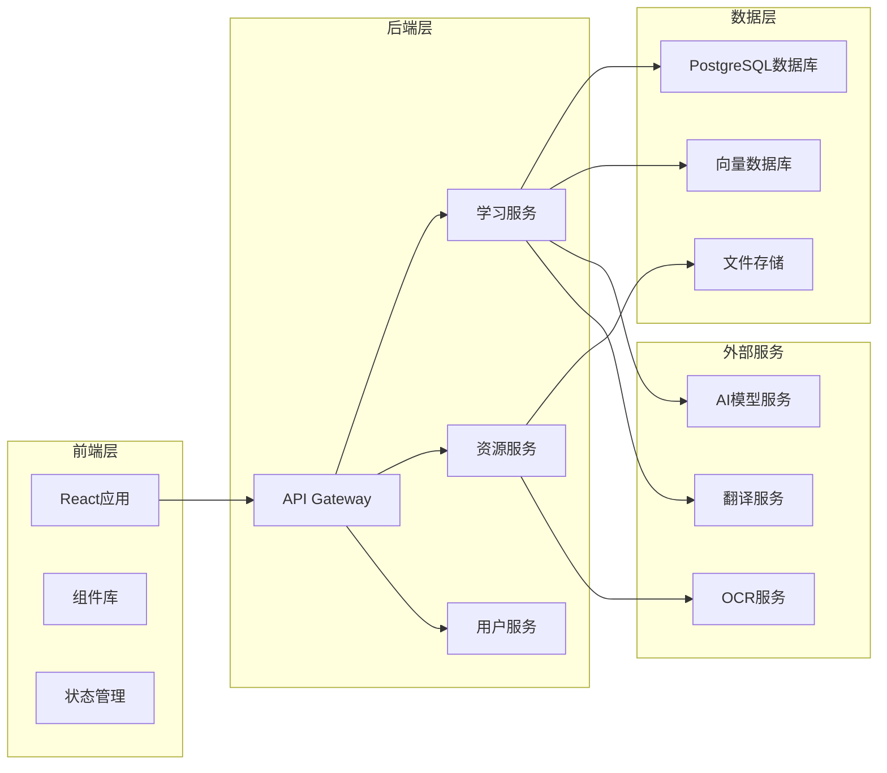
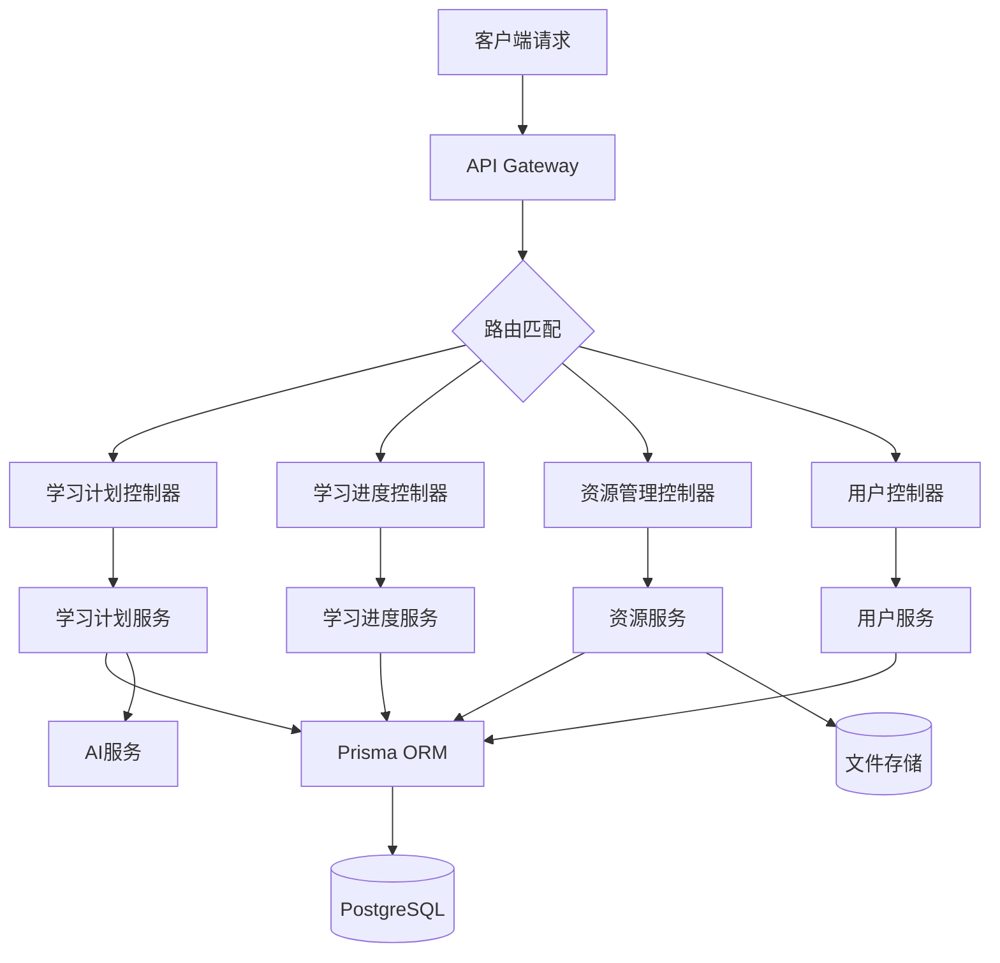
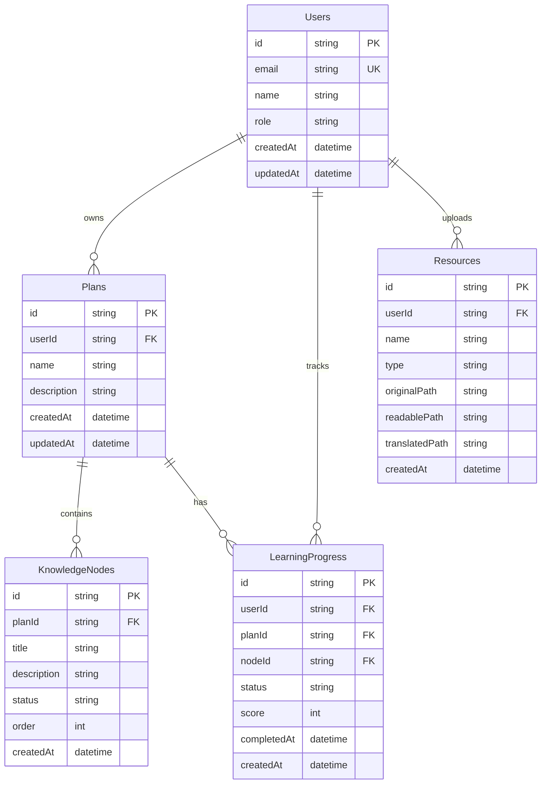

# 学习智能体平台 - 产品需求文档

## 1. Product Overview

**学习智能体平台**是一个面向所有有学习需求人群的AI辅助学习平台，旨在通过智能提示词工程和个性化学习路径规划，帮助用户高效掌握知识。平台支持多种学习场景，从应试复习到终身学习，为不同层次的学习者提供定制化学习体验。

- **核心目标**: 打造一个可扩展、可定制的学习智能体开发平台，让用户能够快速构建专属的学习助手
- **目标用户**: 学生、职场人士、终身学习者等所有有学习需求的人群
- **市场价值**: 通过AI驱动的个性化学习，提升学习效率，降低学习门槛

## 2. Core Features

### 2.1 User Roles
| Role | Registration Method | Core Permissions |
|------|---------------------|------------------|
| **普通用户** | Email/手机号注册 | 创建学习计划、使用智能复习、查看学习进度 |
| **高级用户** | 付费订阅 | 自定义提示词、高级分析、导出学习数据 |
| **开发者** | 开发者认证 | 访问API、创建自定义智能体模板 |

### 2.2 Feature Module
1. **首页**: 学习概览、快速入口、推荐学习内容
2. **学习计划**: 知识路线规划、进度追踪、智能推荐
3. **智能复习**: AI驱动的知识点讲解、题目练习、错题分析
4. **资源管理**: 资料上传、可读化转换、文件管理
5. **个人中心**: 用户设置、学习统计、数据导出

### 2.3 Page Details
| Page Name | Module Name | Feature description |
|-----------|-------------|---------------------|
| **首页** | 学习概览 | 展示学习进度、今日学习目标、推荐内容 |
| **首页** | 快速入口 | 快捷跳转到各功能模块 |
| **学习计划** | 知识路线 | 可视化知识图谱、学习路径规划 |
| **学习计划** | 进度追踪 | 学习进度统计、完成度展示 |
| **智能复习** | AI讲解 | 知识点详细讲解、前置概念补充 |
| **智能复习** | 练习测试 | 题目练习、即时反馈、错题记录 |
| **资源管理** | 文件上传 | 支持PDF、图片、视频等多种格式 |
| **资源管理** | 可读化转换 | OCR识别、文本提取、翻译功能 |
| **个人中心** | 学习统计 | 学习时长、知识点掌握度、成就徽章 |
| **个人中心** | 设置 | 用户信息、偏好设置、数据导出 |

## 3. Core Process

### 用户学习流程
1. 用户登录平台，查看学习概览
2. 创建或选择学习计划
3. 按照知识路线进行学习
4. AI智能讲解知识点
5. 完成练习测试
6. 查看学习进度和统计

### 资源管理流程
1. 上传学习资料
2. 系统自动进行可读化转换
3. 分类管理学习资源
4. 在学习中引用资源



## 4. User Interface Design

### 4.1 Design Style
- **主色调**: 清新蓝绿色系 (#10B981, #06B6D4)，传达知识与成长的感觉
- **辅助色**: 温暖橙色 (#F59E0B) 用于强调和交互元素
- **按钮风格**: 圆角矩形，hover时有缩放动画效果
- **字体**: 标题使用 Inter Bold，正文使用 Inter Regular
- **布局风格**: 卡片式布局，清晰的信息层级
- **图标风格**: 简洁线性图标，使用Lucide图标库

### 4.2 Page Design Overview
| Page Name | Module Name | UI Elements |
|-----------|-------------|-------------|
| **首页** | 学习概览 | 进度圆环、今日目标卡片、推荐内容列表 |
| **首页** | 快速入口 | 功能图标网格、hover动画效果 |
| **学习计划** | 知识路线 | 可视化知识图谱、节点连线动画 |
| **学习计划** | 进度追踪 | 进度条、完成百分比、时间统计 |
| **智能复习** | AI讲解 | Markdown内容展示、代码高亮、折叠面板 |
| **智能复习** | 练习测试 | 题目卡片、选项按钮、即时反馈动画 |
| **资源管理** | 文件上传 | 拖拽上传区域、文件列表、状态标识 |
| **个人中心** | 学习统计 | 图表展示、成就徽章墙 |

### 4.3 Responsiveness
- **桌面端**: 完整功能展示，多列布局
- **平板端**: 自适应布局，保持核心功能
- **移动端**: 单列布局，简化导航

### 4.4 交互设计
- 平滑滚动和页面过渡动画
- 学习进度实时更新
- 答题反馈动画效果
- 资源上传进度指示

---

## 技术架构文档

## 1. Architecture Design



## 2. Technology Description
- **前端**: React@18 + TypeScript + TailwindCSS@3 + Vite
- **状态管理**: Zustand
- **路由**: React Router DOM
- **后端**: Express@4 + TypeScript
- **数据库**: PostgreSQL + Prisma ORM
- **文件存储**: Supabase Storage
- **AI集成**: OpenAI API / Claude API

## 3. Route Definitions
| Route | Purpose |
|-------|---------|
| `/` | 首页 - 学习概览 |
| `/plans` | 学习计划列表 |
| `/plans/:id` | 学习计划详情 |
| `/study` | 智能复习页面 |
| `/resources` | 资源管理 |
| `/profile` | 个人中心 |

## 4. API Definitions

### 学习计划 API
```typescript
interface Plan {
  id: string;
  name: string;
  description: string;
  knowledgeRoute: KnowledgeNode[];
  createdAt: Date;
  updatedAt: Date;
}

interface KnowledgeNode {
  id: string;
  title: string;
  description: string;
  status: 'pending' | 'in_progress' | 'completed';
  dependencies: string[];
}
```

### 学习进度 API
```typescript
interface LearningProgress {
  userId: string;
  planId: string;
  nodeId: string;
  status: 'pending' | 'in_progress' | 'completed';
  score?: number;
  completedAt?: Date;
}
```

### 资源文件 API
```typescript
interface Resource {
  id: string;
  userId: string;
  name: string;
  type: 'pdf' | 'image' | 'video' | 'text';
  originalPath: string;
  readablePath?: string;
  translatedPath?: string;
  createdAt: Date;
}
```

## 5. Server Architecture Diagram



## 6. Data Model

### 6.1 Data Model Definition



### 6.2 Data Definition Language

```sql
-- Users Table
CREATE TABLE users (
    id UUID PRIMARY KEY DEFAULT gen_random_uuid(),
    email VARCHAR(255) UNIQUE NOT NULL,
    name VARCHAR(255),
    role VARCHAR(50) DEFAULT 'user',
    created_at TIMESTAMP DEFAULT CURRENT_TIMESTAMP,
    updated_at TIMESTAMP DEFAULT CURRENT_TIMESTAMP
);

-- Plans Table
CREATE TABLE plans (
    id UUID PRIMARY KEY DEFAULT gen_random_uuid(),
    user_id UUID REFERENCES users(id),
    name VARCHAR(255) NOT NULL,
    description TEXT,
    created_at TIMESTAMP DEFAULT CURRENT_TIMESTAMP,
    updated_at TIMESTAMP DEFAULT CURRENT_TIMESTAMP
);

-- Knowledge Nodes Table
CREATE TABLE knowledge_nodes (
    id UUID PRIMARY KEY DEFAULT gen_random_uuid(),
    plan_id UUID REFERENCES plans(id),
    title VARCHAR(255) NOT NULL,
    description TEXT,
    status VARCHAR(20) DEFAULT 'pending',
    "order" INT DEFAULT 0,
    created_at TIMESTAMP DEFAULT CURRENT_TIMESTAMP
);

-- Learning Progress Table
CREATE TABLE learning_progress (
    id UUID PRIMARY KEY DEFAULT gen_random_uuid(),
    user_id UUID REFERENCES users(id),
    plan_id UUID REFERENCES plans(id),
    node_id UUID REFERENCES knowledge_nodes(id),
    status VARCHAR(20) DEFAULT 'pending',
    score INT,
    completed_at TIMESTAMP,
    created_at TIMESTAMP DEFAULT CURRENT_TIMESTAMP
);

-- Resources Table
CREATE TABLE resources (
    id UUID PRIMARY KEY DEFAULT gen_random_uuid(),
    user_id UUID REFERENCES users(id),
    name VARCHAR(255) NOT NULL,
    type VARCHAR(20),
    original_path VARCHAR(500),
    readable_path VARCHAR(500),
    translated_path VARCHAR(500),
    created_at TIMESTAMP DEFAULT CURRENT_TIMESTAMP
);
```